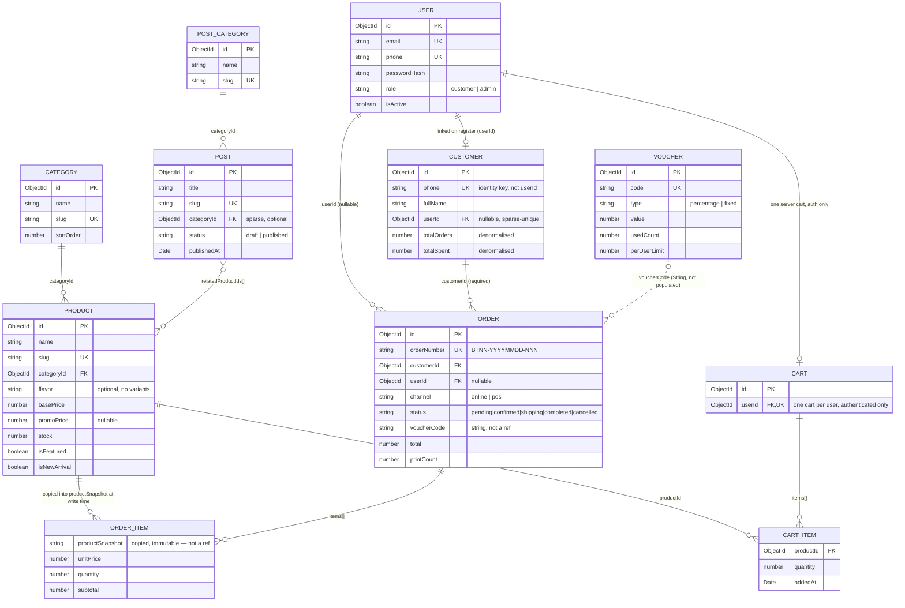

# Entity-Relationship Diagram — Bánh Tráng Nhà Na

> Companion to `docs/server/MODELS.md`, which has the full field-by-field breakdown.
> This diagram shows only the fields relevant to understanding relationships —
> not every field on every model. Rendered with Mermaid (GitHub renders this natively).

## Reading this diagram

- **Solid lines (`||--o{`, `||--o|`)** are real Mongoose `ref`s — the referenced document can be populated.
- **Dotted line (`..o{`)** from `VOUCHER` to `ORDER` is deliberately not a `ref`: `Order.voucherCode` is a plain string, not an ObjectId, so a voucher can be deleted without needing to touch historical orders.
- **`ORDER_ITEM.productSnapshot`** is drawn as a relationship for readability, but it is a **copied value, not a live reference** — this is the single most important rule in the whole schema (`docs/system/SRS.md` §6, rule 5). An order's line items must read the same a year from now even if the product's name, price, or images change or the product is deleted entirely.
- **`CART`** only exists for authenticated users. A guest's cart lives in the storefront's browser storage and is never written to this collection — there is no "guest cart" entity in the database at all.
- **`CUSTOMER`** is the identity root for purchase history, not `USER`. `Customer.userId` starts `null` and is only set once the phone number's owner registers or logs in — this is what makes guest checkout compatible with a "customer" admin view (SRS D5).
